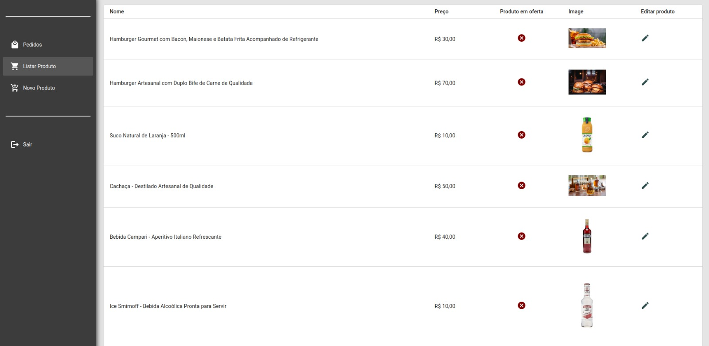
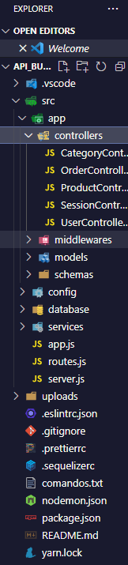

 

<!-- ABOUT THE PROJECT -->
<h2> :pencil: Sobre o projeto</h2>

<h2 align="justify"> 
 Este projeto é um sistema de gerenciamento de pedidos que utiliza Docker e PostgreSQL como banco de dados e MongoDB como banco de imagens e informações do usuário. O back-end foi desenvolvido utilizando o Sequelize e Migration e permite a criação, edição e exclusão de pedidos, categorias e ofertas, além de armazenar informações do usuário com criptografia na senha e token de acesso. O sistema possui modo admin para gerenciamento de dados e modo de ofertas de pedidos para visualização dos mesmos.
</h2>

<h2> :books: Organização de pastas</h2>

 

