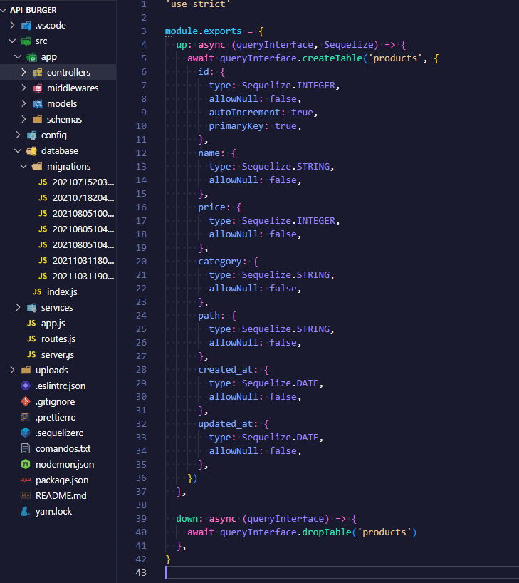
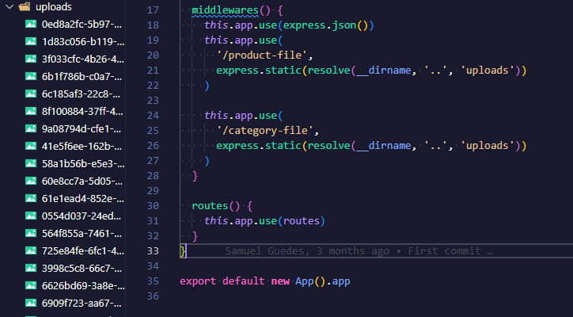
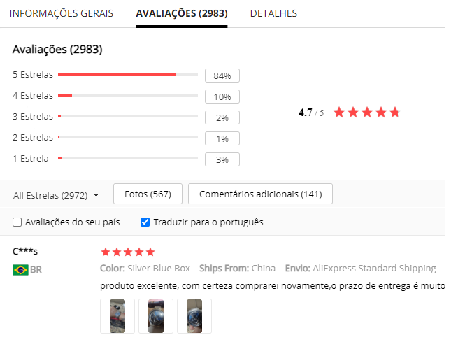
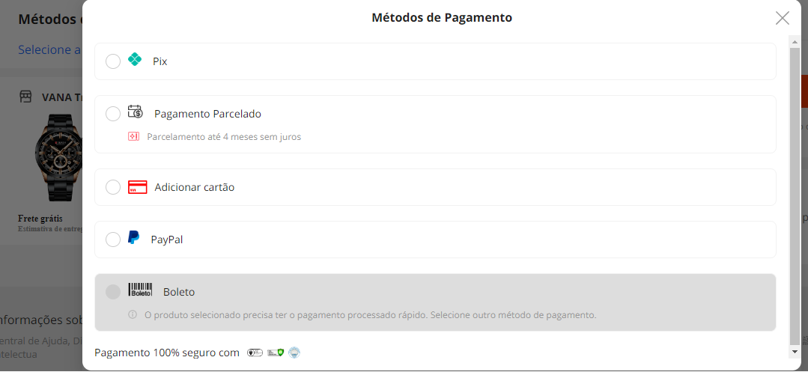

 

<!-- ABOUT THE PROJECT -->
<h2> :pencil: Sobre o projeto</h2>

<h2 align="justify"> 
 Este projeto é um sistema de gerenciamento de pedidos que utiliza Docker e PostgreSQL como banco de dados e MongoDB como banco de imagens e informações do usuário. O back-end foi desenvolvido utilizando o Sequelize e Migration e permite a criação, edição e exclusão de pedidos, categorias e ofertas, além de armazenar informações do usuário com criptografia na senha e token de acesso. O sistema possui modo admin para gerenciamento de dados e modo de ofertas de pedidos para visualização dos mesmos.
</h2>

<h2> :books: Organização de pastas</h2>

   

Estes diretórios compõem a estrutura de um projeto de software baseado em MVC (Model-View-Controller):

Controllers: é onde estão as classes responsáveis por lidar com as requisições HTTP e controlar o acesso aos dados da aplicação. Eles determinam como as requisições do usuário serão manipuladas e como os dados serão retornados.

Models: contém as classes que representam as entidades da aplicação e são responsáveis por validar, salvar e buscar informações do banco de dados.

Schemas: são os modelos de dados que descrevem a estrutura das entidades e as regras de validação a serem seguidas.

Config: contém configurações globais da aplicação, como configurações de banco de dados, autenticação, segurança, entre outras.

Database: é onde as classes de acesso ao banco de dados estão localizadas. Elas são responsáveis por executar operações CRUD (create, read, update, delete) e outras operações relacionadas ao banco de dados.

Services: são classes que contêm lógicas de negócio complexas e são responsáveis por realizar tarefas específicas da aplicação, como processamento de pagamentos, envio de e-mails, entre outras.

Routes: são as rotas da aplicação que determinam como as requisições do usuário serão encaminhadas para os controladores corretos.

Upload: é onde as imagens e outros arquivos enviados pelos usuários são armazenados.

Esses diretórios trabalham juntos para formar a estrutura de um aplicativo de software de alta qualidade e escalável.

<h2> :whale: Docker/Postgres</h2>

Este projeto utiliza o Postgres como banco de dados e o Docker para gerenciar e enviar as tabelas. O processo de criação das tabelas foi realizado através de migrations, garantindo a consistência e organização dos dados armazenados. O Docker permite que a configuração e o gerenciamento do banco de dados sejam feitos de forma eficiente e escalável. A utilização do Postgres e do Docker proporciona uma solução robusta e flexível para armazenar e gerenciar dados.

<h2> :camera: Docker/Postgres</h2>

  
  

Este trecho de código se refere ao uso do middleware "express.static" do ExpressJS para servir arquivos estáticos. O método "express.static" está sendo usado para servir os arquivos localizados na pasta "uploads" na rota "/product-file". O caminho completo da pasta é definido como "resolve(__dirname, '..', 'uploads')", onde __dirname é uma constante global que representa o diretório atual do arquivo em questão e ".." significa o diretório pai. Portanto, o caminho é definido como o diretório pai do diretório atual.

<h2> :construction_worker_man: Atualizações</h2>

  
  

Nos próximos updates, adicionaremos a funcionalidade de comentários e avaliação por produto. Isso permitirá que os usuários compartilhem suas opiniões e experiências com os produtos oferecidos. Além disso, também incluiremos novas formas de pagamento para garantir ainda mais comodidade aos nossos usuários. Outra novidade será a possibilidade de cadastrar um endereço de entrega e calcular o valor do frete, para que nossos usuários possam ter um orçamento mais preciso antes de finalizar a compra.

